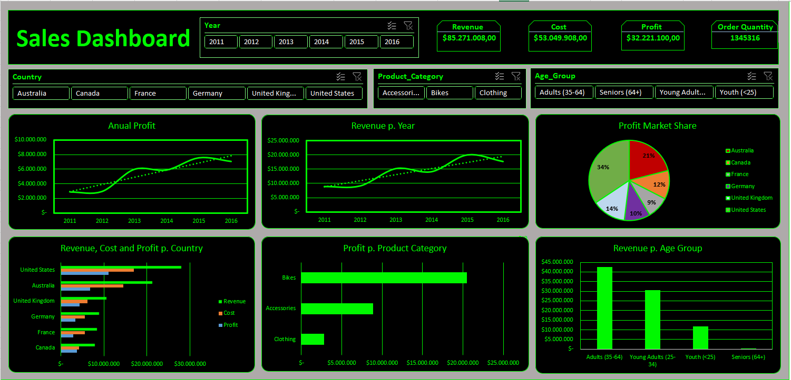

# 🚴‍♂️ The Bicycle Shop – Verkaufs- & Profitabilitätsanalyse (Excel Dashboard)

## 🎯 Projektziel
Ziel des Projekts war der Aufbau eines interaktiven Excel-Dashboards zur Analyse von Verkaufs- und Profitabilitätsdaten für den Zeitraum 2011–2016.  
Der Fokus lag auf der Identifikation von umsatz- und gewinnstarken Märkten, Produkten und Kundensegmenten.

---

## 🧩 Aufgabenstellung
Analysiere Verkaufs- und Marktdaten eines internationalen Fahrradunternehmens, um:
- die profitabelsten Märkte und Produktkategorien zu identifizieren,  
- Rabattstrukturen zu optimieren,  
- Handlungsempfehlungen für Kosten- und Preisstrategien abzuleiten.

---

## 🧮 Datengrundlage
- Quelle: Unternehmensdaten 2011–2016 (Excel-Datei `Bike-Projekt_Thorsten_Teetzen.xlsx`)  
- Struktur: Verkaufsdaten, Kundensegmente, Regionen, Produktkategorien  
- Tools: Microsoft Excel (PivotTables, Slicer, Power Query, Diagramme)

---

## 📊 Dashboard-Inhalte
Das interaktive Dashboard enthält:
- **Kundenanalyse** (Altersgruppen, Geschlechterverteilung)
- **Bestellmengen & Rabattstrukturen** (B2C vs. B2B)
- **Umsatz & Marktanalyse** (nach Ländern und Produktkategorien)
- **Profitabilitätsanalyse** (Kostenquoten & Margen)
- **Strategische Empfehlungen** (z. B. für Frankreich & USA)

---

## 📈 Ergebnisse
- USA & Australien sind die profitabelsten Märkte  
- Fahrräder generieren über **70 %** des Gesamtumsatzes  
- Frankreich weist höchste Kostenquote auf → Handlungsbedarf  
- Empfehlung: Rabattstruktur und Kostenmanagement in Frankreich optimieren, Fokus auf margenstarke Produkte und US-Expansion

---

## 🧠 Learnings
- Dashboard-Design mit dynamischen Filtern und KPI-Karten
- Automatisierte Datenaufbereitung mit Power Query
- Storytelling mit Daten in PowerPoint-Form

---

## 📁 Projektdateien
| Datei | Beschreibung |
|--------|---------------|
| `Bike-Projekt_Thorsten_Teetzen.xlsx` | Interaktives Excel-Dashboard |
| `Bike-Projekt_Thorsten_Teetzen.pptx` | Präsentation der Ergebnisse |

---

## 👤 Autor

**Thorsten Teetzen**  
*Data Analyst (IHK-Zertifizierung in Ausbildung)*  

📅 **Projektzeitraum:** März 2025  
🌍 **Standorte:** Germany / Asia (Remote)  
🔗 [LinkedIn-Profil](https://www.linkedin.com/in/thorsten-teetzen-744891350)
